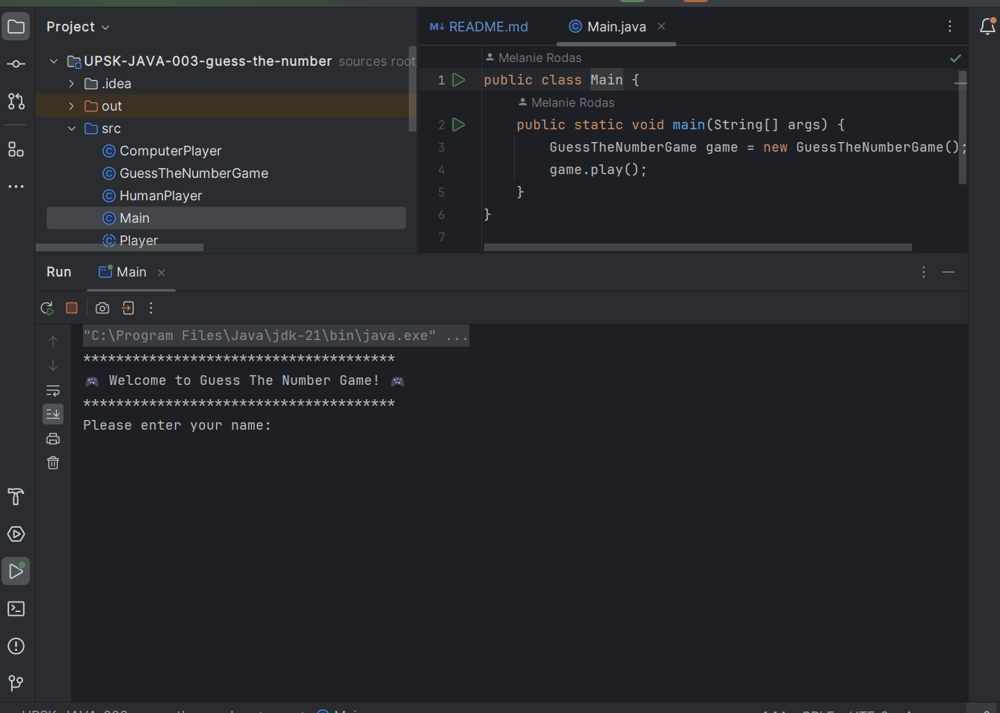

# Adivina el Número - Guess the Number

## Índice

- [1. Preámbulo](#1-preámbulo)
- [2. Demo del Proyecto](#2-Demo-del-proyecto)
- [3. Objetivos de Aprendizaje](#3-objetivos-de-aprendizaje)
- [4. Consideraciones Generales](#4-consideraciones-generales)
---

## 1. Preámbulo

En la actualidad, Java es uno de los lenguajes de programación más utilizados en
el mundo. A pesar de la diversidad de plataformas y herramientas disponibles, es
fundamental tener una base sólida en los conceptos fundamentales de Java y en la
programación orientada a objetos (OOP). El objetivo de este proyecto es
introducirte al mundo de Java a través de un juego simple y divertido.

## 2. Demo del Proyecto

Es un juego interactivo que se desarrolla en el terminal, donde la jugadora y el
ordenador se turnan para intentar adivinar un número aleatorio entre 1 y 100.
Deben tener en cuenta la tentativa anterior, si fue "muy alta" o "muy baja". Además, 
el juego se llevará a cabo en el terminal usando Java.

### Instrucciones

Antes de comenzar, asegúrate de lo siguiente:

1. Clona el repositorio utilizando el siguiente comando: git clone [repositorio]
2. Ubica el archivo Main.java.
3. Inicia el juego utilizando: click en Run ´Main´ o MAYÚS+F10
¡Que inicie el juego de adivinanzas de números! 🎮🎲

## 3. Objetivos de Aprendizaje

### Java

- [ ] **Datos primitivos vs no primitivos**

- [ ] **Cadenas**

- [ ] **Arreglos**

- [ ] **Modificadores de acesso (public, private, protected)**

- [ ] **Uso de condicionales**

- [ ] **Uso de bucles (Loops)**

- [ ] **ArrayList**

- [ ] **JUnit**

- [ ] **Mockito**

### Programación Orientada a Objetos (OOP)

- [ ] **Clases**

- [ ] **Objetos**

- [ ] **Métodos**

- [ ] **Atributos**

- [ ] **Constructores**

- [ ] **Encapsulamiento**

- [ ] **Abstracción**

- [ ] **Composición**

- [ ] **Interfaces**

- [ ] **Herencia (super, extends, override)**

- [ ] **Lenguaje de Modelado Unificado (UML, class diagrams)**

## 4. Consideraciones Generales

- Duración del proyecto: Se estima que este proyecto tomará de 1 a 2 sprints.
- Debe implementarse en Java. Las únicas dependencias externas que se pueden utilizar
  son JUnit y Mockito para pruebas unitarias.
- El juego se llevará a cabo en el terminal. Las pruebas se pueden ejecutar
  en el terminal o en su IDE
  (se recomienda usar [IntelliJ Community Edition](https://www.jetbrains.com/idea/download/)).
- Se utilizará un número aleatorio entre 1 y 100 como número secreto.
- La jugadora y el ordenador se turnarán para adivinar el número.
- Después de cada turno, se mostrarán información sobre la suposición realizada.
- El juego terminará cuando se adivine el número.
  Se mostrará una lista de todas las tentativas de la jugadora ganadora.
- Al terminar cada sprint, antes de la ceremonia de Sprint Review, deberás agregar
  una nueva entrada al inicio del archivo Changelog con los avances y aprendizajes
  del último sprint, usando las indicaciones de la [guía](https://github.com/Laboratoria/changelog-guide/)
  para changelog de proyectos en Laboratoria

### Diagrama de Clases

#### `GuessTheNumberGame`

**Propósito:**
Maneja la lógica principal, decide qué jugador asume el próximo turno.

**Atributos:**

- `random`: Generador de números aleatorios.
- `targetNumber`: Número aleatorio entre 1 y 100 a adivinar en la partida actual.

**Métodos estáticos (`static`):**

- `main(String[] args)`: Inicia el juego y genera el número aleatorio.
- `checkGuess(Player player)`: Ejecuta un turno, obtiene la suposición
  y evalúa el nuevo estado de la partida.

#### `Player`

**Propósito:**
Representa a una jugadora genérica. Es una clase abstracta.
Define los atributos y métodos que todas las _clases_ de jugadoras deben compartir:

**Atributos:**

- `name`: El nombre de la jugadora.
- `guesses`: El historial de suposiciones de la jugadora.

**Métodos:**

- `makeGuess()`: Devuelve la suposición de la jugadora. Es un método abstracto.
- `getName()`: Devuelve el nombre de la jugadora.
- `getGuesses()`: Devuelve el historial de suposiciones de la jugadora.

#### `HumanPlayer` y `ComputerPlayer` (heredan de `Player`)

**Propósito:**
Representa a las jugadoras _Humana_ y _Computadora_, respectivamente.

**Métodos:**

- `makeGuess()`: Método que cada clase que hereda de `Player` debe implementar.

**Relaciones:**

- La clase `GuessTheNumberGame` interactúa con las clases `HumanPlayer`
  y `ComputerPlayer` para gestionar el juego.
- Tanto la clase `HumanPlayer` como `Computer Player` son subclases de `Player`,
  lo que implica que heredan todas sus propiedades y métodos,
  pero también tienen algunas características adicionales propias.

Este diseño de clases permite separar las responsabilidades,
facilitando el mantenimiento y posibles extensiones del juego en el futuro.

Por ejemplo, podríamos añadir diferentes jugadoras "máquina" con diferentes
estrategias para la suposición automática, un nuevo tipo de
jugadora "remota" o incluso diferentes niveles de dificultad.

